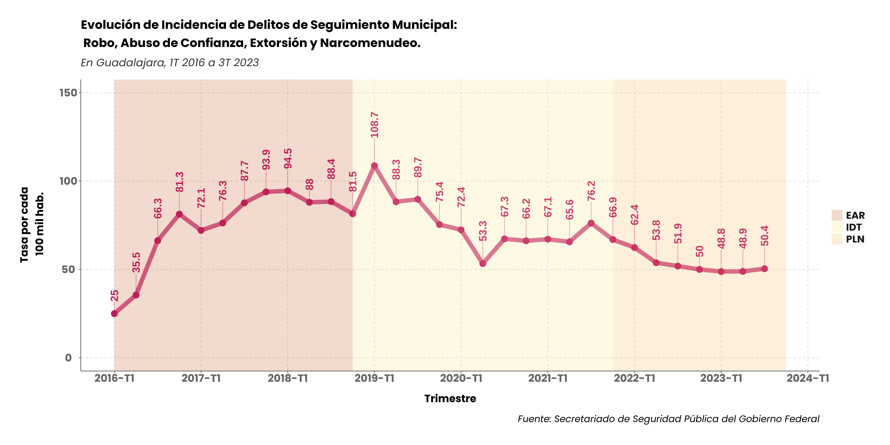

```{r setup, include=FALSE}
options(htmltools.dir.version = FALSE)
knitr::opts_chunk$set(
  fig.width = 9, fig.height = 3.5, fig.retina = 3,
  out.width = "100%",
  cache = FALSE,
  echo = TRUE,
  message = FALSE,
  warning = FALSE,
  hiline = TRUE
)
```

```{r funciones auxiliares, include=FALSE}
listar <- function(lista, conjuncion = " y ") {
  v <- paste(lista[-length(lista)], collapse = ", ")
  v <- paste0(v, conjuncion, tail(lista, 1))

  return(v)
}

racionar <- function(valor) {
  v <- valor %>%
    round(1) %>%
    fractions() %>%
    as.character() %>%
    str_replace("/", " de cada ")

  return(v)
}
```

```{r xaringan-themer, include=FALSE, warning=FALSE}
pacman::p_load(
  xaringanthemer, plotly, purrr,
  readr, magrittr,
  scales,
  MASS,
  tidyverse,
  zoo
)
style_duo_accent(
  primary_color = "#3695A8",
  secondary_color = "#e2fcee",
  inverse_header_color = "#EC429D",
  header_font_google = google_font("Montserrat", "300", family = "semibold"),
  text_font_google = google_font("Roboto", "300", "300i", family = "medium"),
  code_font_google = google_font("Fira Mono"),
  text_font_size = 2,
  title_slide_background_color = "#369CA8",
  title_slide_text_color = "#d0e340"
)
```
<style>
div.footnotes {
  position: absolute;
  bottom: 0;
  margin-bottom: 10px;
  width: 80%;
  font-size: 0.6em;
}
.nobullet li {
  list-style-type: none;
}
.red { color: red; 
  font-weight: bold;
}
.green { color: green; 
  font-weight: bold;
}
.black { color: black; 
  font-weight: bold;
}
.center2 {
  margin: 0;
  position: absolute;
  top: 50%;
  left: 50%;
  -ms-transform: translate(-50%, -50%);
  transform: translate(-50%, -50%);
}

.orange {
color: #dd8d29;
}
</style>

# Introducción

<span style= "font-size:1.3em;">
El presente análisis tiene como objetivo mostrar los resultados presentados por la **Encuesta Nacional de Seguridad Pública Urbana (ENSU)** en la ciudad de  Monterrey  y mostrar cómo dichos resultados se comparan con el promedio de todas las ciudades consideradas por dicha encuesta a nivel nacional.

<span style="font-size:1.3em;">
La ENSU **se enfoca en medir la percepción de seguridad publica** de la población mayor de 18 años residente de las principales ciudades de México. Esta encuesta se realiza desde el tercer trimestre de 2013 y sirve como un seguimiento trimestral de temas tratados de manera anual y a mayor profundidad por la Encuesta Nacional de Victimización y Percepción sobre Seguridad Pública (ENVIPE).


---

# Introducción

El tamaño muestral de la ENSU, ha aumentado a lo largo de los trimestres volviéndose más representativa:
```{r, echo=FALSE}
table_header <- c("Periodo de referencia*", "Unidades de observación", "Población objeto de estudio", "Tamaño de muestra", "Cobertura geográfica")
table_body <- c(
  "Del 1° Trimestre de 2016 a 2° Trimestre de 2024",
  "Las viviendas seleccionadas, los hogares y los residentes del hogar y las personas seleccionadas en el hogar",
  "Población de 18 años y más",
  "11,400-27,850 viviendas a nivel nacional y 300 viviendas en Monterrey",
  "75 ciudades a nivel nacional y 7 en Nuevo León "
)

table_frame <- data.frame(table_body)
row.names(table_frame) <- table_header
table <- kableExtra::kable_styling(kableExtra::column_spec(knitr::kable(table_frame, format = "html"), 1, bold = TRUE))
gsub("<thead>.*</thead>", "", table)
```


*Fuente*: Documentación de ENSU (INEGI).

.footnote[\* *Nota*: Debido a la pandemia ocasionada por el COVID-19, no se realizó la ENSU del Tercer trimestre de 2020.]


---

# Introducción

INEGI utiliza el **coeficiente de variación** (CV)*  para determinar si las estimaciones de la ENSU son precisas, de acuerdo a los siguientes parámetros:
* Alto si el CV se encuentra entre 0% y 15%.

* Moderado si el CV se encuentra entre 15% y 30%.

* Bajo si el CV es mayor a 30%.

En el presente documento se consideraron estos parámetros al momento de analizar los resultados nacionales y de Monterrey, todos los datos aquí presentados son estimaciones significativas, es decir por debajo del umbral del 30% en sus coeficiente de variación.

.footnote[\* El coeficiente de variación es una medida de tendencia central que nos indica la desviación de los datos observados con respecto a la media y, al mismo tiempo, las dispersiones que tienen los datos dispersos entre sí. Se calcula dividiendo la desviación estándar de la muestra, entre la media de la muestra. ]

---

# Introducción

La **cobertura temática de la ENSU** es la siguiente:
* Sensación de inseguridad por temor al delito.
* Expectativa sobre la tendencia del delito.
* Atestiguación de conductas delictivas o antisociales.
* Cambio de rutinas por temor a ser víctimas del delito.
* Desempeño de la policía como autoridad de seguridad pública.
* Conflictos y conductas antisociales.
* Desempeño gubernamental.
* Consulta de información sobre seguridad pública.
* Conocimiento sobre programas de prevención del delito.
* Violencia en el entorno familiar.

---
class: inverse center middle

# Percepción de inseguridad

---
## Evolución en la percepción de inseguridad 


---

```{r echo=FALSE, message=FALSE, warning=FALSE, include = FALSE}
tabla_perc <- read_csv("04_temp/tabla_perc.csv")
tabla_camhab <- read_csv("04_temp/tabla_camhab.csv")
tabla_lugares <- read_csv("04_temp/tabla_lugares.csv")
tabla_programas <- read_csv("04_temp/tabla_conoc_program1.csv")
```

## Percepcion en capitales


---

## Percepción en capitales


---

class: inverse center middle
### Percepción en capitales
.red[Monterrey regresa al top 5 de ciudades capitales con mayor percepción de inseguridad]. 

```{r diferencia, include=FALSE}
df_percp <- read_rds("04_temp/df_percep.rds")
x <- df_percp %>%
  filter(
    var_id == "Monterrey",
    trim >= max(trim) - 0.25
  ) %>%
  use_series(por)

diferencia <- label_percent(0.1)(x[1] - x[2])
```

Sin embargo, la diferencia en la percepción de inseguridad con respecto al trimestre pasado fue del `r diferencia` en Monterey.

Las ciudades de Zacatecas (PVEM), Toluca (PRI) y Chilpancingo (Morena) se mantienen como las capitales con mayor índice de percepción de inseguidad por 3 trimestres consecutivos.

---
### Sensación de inseguridad en espacio publico


.pull-left[

]

.pull-right[


]

---


### Sensación de inseguridad en espacio público

```{r Sensación de Inseguridad en lugares públicos, include=FALSE}
df_percep_inseg <- read_rds("04_temp/df_percep_lugares_publicos.rds")

df_percep_inseg_last <- df_percep_inseg %>%
  filter(
    fecha == max(fecha)
  ) %>%
  arrange(por)

(df_comparacion_year <- df_percep_inseg %>%
  dplyr::select(-c("fecha", "tot", "total")) %>%
  mutate(
    trim = yearqtr(trim)
  ) %>%
  pivot_wider(
    names_from = trim,
    values_from = por
  ) %>%
  mutate(
    diferencia_ultima = `2024 Q2` - `2024 Q1`
  ))

mejores_seguridad <- df_comparacion_year %>%
  arrange(diferencia_ultima)

lugares_mejores <- mejores_seguridad %>%
  filter(
    diferencia_ultima < 0
  ) %>%
  pull(var)


racionar(x)
```

.pull-left[

Con respecto al año pasado **`r nrow(mejores_seguridad)` de `r nrow(df_comparacion_year)`  espacios públicos son percibidos como más seguros por los regios (`r listar(lugares_mejores)`).** 

**El índice que mas bajo** con respecto al año anterior fue el **`r mejores_seguridad$var[[1]]`** (`r round(mejores_seguridad$diferencia_ultima[[1]]*100, digits = 1)`pp), seguido por el **`r mejores_seguridad$var[[2]]`** (`r round(mejores_seguridad$diferencia_ultima[[2]]*100, digits = 1)`pp), el **`r mejores_seguridad$var[[3]]`** (`r round(mejores_seguridad$diferencia_ultima[[3]]*100, digits = 1)`pp) y la **`r mejores_seguridad$var[[4]]`** (`r round(mejores_seguridad$diferencia_ultima[[4]]*100, digits = 1)`pp).

Respecto al trimestre anterior, .red[las problemáticas que más incrementaron con respecto al trimestre pasado fueron los de Mercado (+7.1pp) y Escuela (+4.3pp)], aunque hubo mejoría respecto al ano anterior.

En contraste, destaca una mejoría respecto al trimestre pasado en la percepción de seguridad en el **Automóvil** (-6.7pp) y la **Casa** (-2.3pp).
]

.pull-right[
```{r echo=FALSE, message=FALSE, warning=FALSE}
tabla_lugares %>%
  knitr::kable(align = "c") %>%
  kableExtra::kable_styling(font_size = 10) %>%
  kableExtra::column_spec(tabla_lugares, column = 1, bold = TRUE) %>%
  kableExtra::column_spec(tabla_lugares, column = 6, bold = TRUE, color = "white", background = c("#4E94A5", "#64B2B2", "#64B2B2", "#7BBFB3", "#7BBFB3", "#7BBFB3", "#7BBFB3", "#DE7D87", "#DE7D87", "#DE7D87", "#CE7352", "#CE7352"))
```
]
---
class: inverse center middle

# Experiencias de inseguridad

---

### Experiencias de inseguridad


---

### Experiencias de inseguridad


---

### Experiencias de inseguridad


---

### Experiencias de inseguridad


---

### Experiencias de inseguridad


---

### Experiencias de inseguridad


---
class: inverse center middle

### Experiencias de inseguridad

```{r Atestiguación, include=FALSE}
df_atestiguacion <- read_rds("04_temp/df_atestiguacion.rds")

df_atestiguacion
principales_percibidos <- df_atestiguacion %>%
  filter(
    fecha == max(fecha)
  ) %>%
  arrange(-por) %>%
  head(3) %>%
  dplyr::select(var, por)
```

En el Tercer trimestre de 2023, el delito más percibido por los regios fue .red[`r principales_percibidos$var[[1]]`] (`r label_percent(0.1)(principales_percibidos$por[[1]])`), .red[`r principales_percibidos$var[[2]]`] (`r label_percent(0.1)(principales_percibidos$por[[2]])`) y  .red[`r principales_percibidos$var[[3]]`] (`r label_percent(0.1)(principales_percibidos$por[[3]])`). 

---
class: inverse center middle

# Condición de victimización en hogares
.footnote[\* La sección de víctimas solo se incluye en Septiembre y diciembre a excepción de 2020 que se levantó en septiembre y diciembre.]
---

### Condición de victimización en hogares


---
### Tipo de victimas en el hogar


---
### La distancia entre la percepción y la victimización 


### Cambio de hábitos por inseguridad

.pull-left[


]


.pull-right[

A pesar de que la percepción de inseguridad en Monterrey se mantiene por debajo de los niveles del 2do trimestre de 2018, las personas encuestadas reportan haber modificado sus habitos por la inseguridad como método de prevención.

Con respecto al trimestre pasado, **el cambio de hábitos por la inseguridad tuvo una ligera disminución en todos los rubros**, acercándose a los niveles reportados en septiembre de 2022. 

El evitar llevar cosas de valor en la calle y caminar de noche alrededor de sus viviendas son los cambios de rutina que más implementan los regios.

]

---

### Causas de conflictos en municipios de la ZM de Monterrey


---
## Principales problemas en Monterrey


---
class:inverse center middle
### Principales problemas en Monterrey

```{r Principales problemas, include=FALSE}
df_problemas_principales <- read_rds(
  "04_temp/df_percep_lugares_publicos.rds"
)

# Para el texto
lista_de_disminucion <- df_problemas_principales %>%
  filter(
    fecha == max(fecha)
  ) %>%
  arrange(-por) %>%
  mutate(
    rango = rank(-por)
  ) %>%
  dplyr::select(var, rango) %>%
  left_join(df_problemas_principales, by = "var") %>%
  arrange(
    rango, desc(fecha)
  ) %>%
  dplyr::select(
    var, por, trim
  ) %>%
  pivot_wider(
    names_from = trim,
    values_from = por
  ) %>%
  mutate(
    dif_ultimos_trim = `Jun 2024` - `Mar 2024`
  ) %>%
  arrange(dif_ultimos_trim) %>%
  mutate(
    dif_ultimos_trim = label_percent(0.1)(dif_ultimos_trim)
  ) %>%
  dplyr::select(var, dif_ultimos_trim) %>%
  head(4) %>%
  use_series(var)


q <- df_problemas_principales %>%
  filter(
    trim == max(trim)
  ) %>%
  arrange(-por) %>%
  head(3) %>%
  use_series(var)
```

Los tres principales problemas de la ciudad se mantienen: .red[`r str_wrap(q)`]

**Estos problemas tuvieron una disminución con respeto al trimestre pasado.** De igual manera, con respecto al trimestre pasado hubo .red[disminucion en `r lista_de_disminucion`.]

---


## Principales problemas en Monterrey
.pull-left[

]

```{r Problemas principales, include=FALSE}
df_lugares_principales_2 <- read_rds("04_temp/df_problemas_principales.rds")

problematicas_principales <- df_lugares_principales_2 %>%
  filter(
    fecha == max(fecha)
  ) %>%
  arrange(
    desc(total)
  ) %>%
  head(3) %>%
  pull(var) %>%
  str_replace("\n", " ")

disminucion <- df_lugares_principales_2 %>%
  mutate(
    fecha = as.yearqtr(fecha)
  ) %>%
  pivot_wider(
    names_from = fecha,
    values_from = total
  ) %>%
  mutate(
    diferencia_anterior = `2024 Q2` - `2023 Q4`,
    diferencia_year = `2024 Q2` - `2023 Q2`
  ) %>%
  arrange(desc(diferencia_year)) %>%
  rename(
    ultimo_trim = `2024 Q2`
  )

mejorias <- disminucion %>%
  filter(
    diferencia_year < 0
  ) %>%
  pull(var)

(empeoramiento <- disminucion %>% 
  filter(
    diferencia_anterior > 0
  ) %>% 
  arrange(desc(diferencia_anterior))) %>% 
  mutate(
    var = str_replace(var, "\n", " ")
  )
```
.pull-right[
Los `r listar(problematicas_principales)` se han mantenido como las problemáticas que más les preocupan a los regios. Sin embargo, **la preocupación con respecto a `r listar(mejorias)` ha disminuido en el último año**.

Problemas de `r disminucion$var[[1]]` empeoraron considerablemente respecto al año pasado (+`r round(disminucion$diferencia_year[[1]]*100, 1)`pp), .red[`r racionar(disminucion$ultimo_trim[[1]])` regios están insatisfechos con este servicio], aunque hay mejoría respecto al trimestre pasado (-2.4pp).

Otros temas que se han complicado son la .red[`r empeoramiento$var[[1]]`] (+`r label_percent(0.1)(empeoramiento$diferencia_anterior[[1]])`), así como .red[Fallas y fugas en suministro de agua] (+13.7).

]
---
## Principales problemas en Monterrey

---
class: inverse center middle

# (Des) Confianza en las autoridades
---
### (Des) Confianza en autoridades de seguridad pública

.pull-left[


]
.pull-right[

La confianza de los regios en **la Policía Estatal aumentó con respecto al trimestre pasado** (+8.2pp), superando al promedio nacional. 

Con respecto al trimestre pasado, hubo un **aumento en la confianza en la Guardia Nacional (+6.5pp)**, aunque se mantienen por debajo del promedio nacional.
]

---
### Confianza en autoridades de seguridad pública


---
### Confianza en autoridades de seguridad pública


---

```{r Confianza Policía Preventiva Municipal, include=FALSE}
df_ppm <- read_rds("04_temp/df_confianza_policia.rds")

df_ppm

confianza_reciente <- label_percent(0.1)(df_ppm %>% 
    filter(fecha == max(fecha)) %>% 
    pull(por))

(punto_bajo <- df_ppm %>% 
  filter(por == min(por)) %>% 
  pull(trim)) 

puntuacion_bajo <- label_percent(0.1)( 
    df_ppm %>% 
  filter(por == min(por)) %>% 
  pull(por))

puntuacion_reciente <-  label_percent(0.1)( 
    df_ppm %>% 
  filter(trim == max(trim)) %>% 
  pull(por))

df_sp <- read_rds("04_temp/df_confianza_sp.rds")

confianza_estatal <- label_percent(0.1)(df_sp %>% 
  filter(
    fecha == max(fecha),
    var == "Policía Estatal"
    ) %>% 
    pull(por)
  )
```

class:inverse center middle
### Confianza y percepcion de autoridades de seguridad pública
**La Policía Preventiva Municipal ha incrementado su confianza (`r confianza_reciente`)** y sigue aumentando desde su punto más bajo en el Tercer trimestre de 2020, cuando contó con apenas el `r puntuacion_bajo` de la confianza de los regios.  

**La confianza en la Policía Estatal disminuyó y ahora se encuentra en `r confianza_estatal`. El Ejército, Guardia Nacional y Marina presentan un aumento con respecto al trimestre pasado**.

---
## Efectividad del gobierno


La percepción de efectividad, que ha sido una medición muy vólatil y desde 2019 se ha encontrado cuatro veces por debajo del 20%, tuvo un .red[ligero decremento con respecto al trimestre pasado (-3.9pp).]
---

### Corrupción por parte de autoridades de seguridad pública

.pull-left[

]

.pull-right[
.red[Se observa un decremento] al pasar de 47.0% en diciembre de 2023 a 27.3% en junio de 2024.

Un cuarto de los regios continúan declarando que han tenido experiencias de corrupción donde algún miembro de las autoridades de seguridad publica le insinuó, le pidió de forma directa o generó las condiciones para que les diera dinero, un regalo o favor para agilizar, aprobar, o bien, evitar infracciones o detenciones. 

El porcentaje nacional por estas mismas experiencias es de 47.5%, por lo que .red[los regios reportan con menor frecuencia ese tipo de acciones.]

]

---
### Corrupción por parte de autoridades de seguridad pública

---
class: inverse center middle
### Corrupción por parte de autoridades de seguridad pública

Al ser un análisis semestral, los datos del segundo trimestre de 2023 muestran que **la tendencia en Monterrey ha tenido un comportamiento vólatil**, aunque lleva tres trimestres con un comportamiento que podría estabilizarse al igual que la tendencia nacional. Sin embargo, la tendencia nacional se mantiene por debajo del 50%, mientras que Monterrey muestra un índice de 55.3% en el segundo trimestre de 2023.

---
### Expectativas en los proximos 12 meses

.pull-left[
Desde el último año, se ha avanzado de manera paulatina y las expectativas de los regios se vuelven un poco más optimistas. 

Aunque, .red[solo 1 de cada 4 personas piensa que la seguridad de Monterrey mejorará]. Se encuentra 15.5 puntos por debajo del promedio nacional y **ha aumentado 10 puntos desde septiembre de 2022.**

A nivel nacional el optimismo con respecto a la seguridad ha aumentado al pasar de 37.87% en el Tercer trimestre de 2022 al 40.9% en el Tercer trimestre de 2023.
]


.pull-right[

]

---
class: center middle


---
### .orange[Conocimiento de los programas para la prevención de delitos]

.pull-left[
El **conocimiento de los programas para la prevención de delitos** se estudio por primera vez en en último trimestre de 2022. 

Con respecto al trimestre pasado hubo una .red[disminución del 3.1%, más del 34.4% de los regios encuestados conoce los programas], acercándose a la primera medición de diciembre de 2022 del 33.2% de los regios con conocimiento de los programas. Sin embargo, aún hay poca información para analizar a fondo estos datos.
]

.pull-right[
```{r echo=FALSE, message=FALSE, warning=FALSE, fig.align='center'}
tabla_programas %>%
  knitr::kable(align = "c") %>%
  kableExtra::kable_styling(font_size = 12) %>%
  kableExtra::column_spec(tabla_programas, column = 1, bold = TRUE) %>%
  kableExtra::column_spec(tabla_programas, column = 4, bold = TRUE, color = "white", background = c("#CE7352", "#CE7352", "#CE7352"))
```
]

---

## Lo positivo 

- La **percepción de inseguridad se mantiene por debajo de la barrera del 80%**, aproximándose a los niveles de principios de 2018.

- **Todos los índices de experiencias de inseguridad tuvieron una disminucion este trimestre**, destacando la disminución en pandillerismo, venta o consumo de drogas, vandalismo y robo o asalto.

- Desde marzo de 2022, **la confianza en la policía municipal sigue creciendo**. A pesar de ser la autoridad con menor confianza, es el cuerpo de seguridad publica que ha mantenido un incremento en la confianza.

- **Las experiencias de conflicto de la población disminuyeron en todos los indicadores**, destacando una disminución en problemas con los vecinos, problemas relacionados con animales domésticos y molestias por borrachos, drogadictos o pandillas.

- **La percepción de inseguridad en las Calles que habitualmente se usan tuvo una disminución de 10.6%** con respecto al año anterior.

- **La delicuencia como principal problema en la ciudad disminuyó en 10.3% con respecto al trimestre anterior** y en 1.9% con respecto al año pasado.

- **La expectativa de mejora sobre la situación de seguridad en la ciudad aumentó en 10% con respecto al año pasado.**

---
class:inverse
## Lo negativo  

- A pesar de la mejora de percepción de inseguridad desde el Segundo trimestre de 2022, con respecto al trimestre pasado **hubo un ligero aumento de 0.7%.**

- Lo anterior, también repercute en que **Monterrey sigue con los números más altos del AMG* *y regresa al top 5 de ciudades capitales con mayor percepción de inseguridad ocupando el 4° lugar.

- La mayor percepción de inseguridad se encuentra en los **Bancos** (81.9% en ATM y 71.7% en sucursal), el **Transporte público** (67.6%), las **Calles** (66.8%) y la **Carretera** (59.5%). Con respecto al año pasado, aumentó la percepción de inseguridad en la **Carretera**, el **Centro comercial**, la **Casa**, el **Trabajo** y el **Transporte público**.

- **Problemas de recolección de basura** (+18.3%), **Fallas y suministro de agua** (+14.6%) y **Parques y jardines descuidados** (+13.7%) presentan el mayor crecimiento con respecto al trimestre anterior.

- Los problemas más grandes de la ciudad para los regios son los **Baches en calles y avenidas** (71.3%), la **Delincuencia** (58%) y los **Embotellamientos frecuentes** (44.7%).

- La recolección de basura preocupa a **5 de cada 10 regios.** Este problema ha empeorado en 19.7% en comparación con el año pasado.

- A pesar que desde el 4° trimestre de 2022 venía en aumento, **la percepción de la efectividad del gobierno para resolver problemas de la ciudad disminuyo en 0.05%**

---
class: inverse center middle


# Encuesta Nacional de Seguridad Pública Urbana
## Monterrey
**Segundo Trimestre - 2024**
---
class: inverse center middle


# Anexos
## Incidencia Delictiva del Fuero Común
**Segundo Trimestre - 2024**
---
class: center middle

### Incidencia Delictiva del Fuero Común

---
class: center middle

### Incidencia Delictiva del Fuero Común

---
class: inverse center middle

### Incidencia Delictiva del Fuero Común

**La Incidencia Delictiva en Monterrey muestra una tendencia a la baja**, desde su punto más alto registrado en el 3er trimestre de 2017 ha disminuido en 37.06%. El nivel más bajo de incidencia se alcanzó el .red[2do trimestre] de 2020 durante la pandemia de COVID-19.

Al comparar **las tasas de incidencia delictiva por cada 100 mil habitantes, Monterrey se encuentra por debajo del nivel nacional** en todo el período estudiado (1T-2016 al 3T-2023). Y ha disminuido en 40.4% desde el punto más alto en el 3er trimestre de 2017. Actualmente, la tasa de incidencia por cada 100 mil habitantes a nivel nacional es 2 veces mayor que la tasa en Monterrey.

Lo anterior, contrasta con el comparativo de la percepcion de inseguridad, ya que desde .red[principios de 2018 Monterrey se encuentra por arriba de la medición nacional en percepción de inseguridad.] 

---
class: center middle

### Delitos de Alto Impacto

---
class: center middle

### Delitos de Alto Impacto

---
class: inverse center middle

### Delitos de Alto Impacto

Al igual que la Incidencia Delictiva del Fuero Común, **los Delitos de Alto Impacto muestran una tendencia a la baja en Monterrey** desde el ultimo trimestre de 2017 cuando alcanzó su punto más alto. 

Los Delitos de Alto Impacto se dividen en **Delitos Contra la Vida y Contra el Patrimonio**, aunque el total de Delitos de Alto Impacto van a la baja, su comportamiento depende de su clasificación: **Los Delitos Contra el Patrimonio contribuyen a la tendencia a la baja de la totalidad de Delitos de Alto Impacto**; mientras que, .red[los Delitos Contra la Vida no han tenido una reducción mayor a la que tuvieron durante la pandemia] (2T-2020 al 1T-2021).  

Aunque la incidencia del total de delitos del fuero común y de delitos de alto impacto han bajado, .red[los Delitos Contra la Vida se han mantenido constantes en el último año.]

---
class: center middle

### Delitos del Fuero Común de Seguimiento Municipal

---
class: inverse center middle

### Delitos del Fuero Común de Seguimiento Municipal

Desde el 4to trimestre de 2021, **los Delitos del Fuero Común de Seguimiento Municipal han disminuido en 30.6%**. Su punto más alto se registró el 1er trimestre de 2019 (6,713), desde entonces se mantiene una tendencia a la baja y se ha reducido en 56.7%.

El número de **delitos registrados en el 3er trimestre de 2023 (2,126) se acerca a los niveles del 2do trimestre de 2016 (2,496)**.

---
class: center middle

### Incidencia del Robo


---

class: center middle

### Incidencia del Vandalismo


---

class: center middle

### Incidencia de Delitos con Arma de Fuego


---

class: center middle

### Incidencia de Narcomenudeo

---
class: inverse center middle

### Incidencia de Robo, Vandalismo, Delitos con Arma de Fuego y Narcomenudeo

La incidencia del **Robo mantiene una disminución constante desde el 4to trimestre de 2021** (-34.21%) y desde su punto más alto el 3er trimestre de 2017 ha disminuido en 59.68%.

La incidencia del **Vandalismo tuvo una disminución con respecto al trimestre pasado de 29.2%**. Tuvo su punto más alto el 4to trimestre de 2018 y desde entonces muestra una disminución de 76.15%.

La incidencia de **Delitos con Arma de Fuego** ha tenido varios repuntes durante el período estudiado, sin embargo, **mostró una disminución considerable el trimestre pasado de 39.18%.** 

Por último, la incidencia de **Narcomenudeo ha disminuido desde su punto más alto el 1er trimestre de 2016 (-51.4%)** y .red[con respecto al trimestre anterior repuntó] (+42.3%).
---
class: inverse center middle

# Anexos
## Incidencia Delictiva del Fuero Común
**Segundo Trimestre - 2024**
---
class: inverse center middle
# Anexos
## Comparativa Incidencia Delictiva
**Segundo Trimestre - 2024**
---
class: center middle
### Evolución de la Incidencia Delictiva


---
class: center middle
### Evolución de la Incidencia Delictiva

---
class: inverse center middle

### Evolución de la Incidencia Delictiva

La tasa de incidencia delictiva en Monterrey, .red[tuvo su mayor aumento durante 2016] y **comenzó a disminuir a principios de 2019**.

Durante la administración actual, **la tasa Incidencia Delictiva ha mantenido un disminución constante que se acentúo a principios del segundo año de gobierno, alcanzando su punto más bajo durante el 4° trimestre de 2022.**
---
class: center middle
### Evolución de los Delitos de Alto Impacto

---
class: center middle
### Evolución de los Delitos de Alto Impacto


---
class: center middle
### Evolucion de los Delitos de Alto Impacto

---
class: center middle
### Evolución de los Delitos de Alto Impacto

---
class: inverse center middle

### Evolución de los Delitos de Alto Impacto

La disminución de la tasa Incidencia Delictiva esta relacionada con la disminución de los Delitos de Alto Impacto. **Desde principios de 2019 hay una tendencia a la baja en la tasa de incidencia de Delitos de Alto Impacto.**

Durante el primer año de gobierno de la administración actual, **se mantiene esta tendencia a la baja y se estabiliza por debajo de los 30 delitos de alto impacto por cada 100 mil habitantes durante el 2° año de gobierno.**


---
class: center middle
### Evolución de los Delitos de Seguimiento Municipal

---
class: center middle
### Evolución de los Delitos de Seguimiento Municipal


---
class: inverse center middle

### Evolución de los Delitos de Seguimiento Municipal

De principios de 2016 a principios de 2022, .red[la tasa de Delitos de Seguimiento Municipal tuvo un compartamiento variable, con picos a la alta.] 

A inicios de la administración actual, **se presentó una disminucion sostenida en la tasa de incidencia delictiva en los Delitos de Seguimiento Municipal durante el primer año de gobierno**, misma que **se estabilizó alrededor de los 50 delitos por cada 100 mil habitantes durante el segundo año de gobierno.**

---
class: inverse center middle
# Anexos
## Comparativa Incidencia Delictiva
**Segundo Trimestre - 2024**
